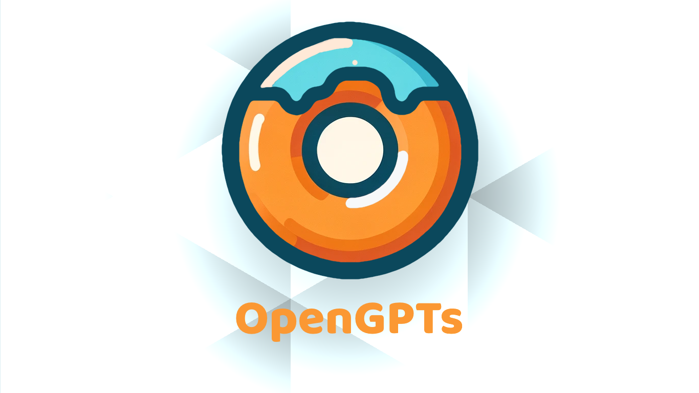

<a name="readme-top"></a>

<div align="center">

<div align="center">

</div>

# OpenGPTs

OpenGPTs 是一款开源的浏览器插件，支持语音输入,函数调用,多模型,多模态,批量对话，网页端或者APIKey调用模型<br/>
我们希望这款插件可以帮助你更高效的使用GPT，甚至未来代替你控制网页，实现各种RPA操作 <br/>

**简体中文** · [Enlish](./README_EN.md) · [Changelog](./changeLog.md) · [Report Bug][github-issues-link] · [Request Feature][github-issues-link]
</br>

<!-- SHIELD GROUP -->

[![][github-release-shield]][github-release-link]
[![][vercel-shield]][vercel-link]

[![][github-releasedate-shield]][github-releasedate-link]
[![][github-contributors-shield]][github-contributors-link]
[![][github-forks-shield]][github-forks-link]
[![][github-stars-shield]][github-stars-link]<br>
[![][github-issues-shield]][github-issues-link]
[![][github-license-shield]][github-license-link]<br>


**Share OpenGPTs Repository**

[![][share-x-shield]][share-x-link]
[![][share-telegram-shield]][share-telegram-link]
[![][share-whatsapp-shield]][share-whatsapp-link]
[![][share-reddit-shield]][share-reddit-link]
[![][share-weibo-shield]][share-weibo-link]
[![][share-mastodon-shield]][share-mastodon-link]
[![][share-linkedin-shield]][share-linkedin-link]

</div>


## 👋🏻 开始和介绍

开源的GPT浏览器插件并不多，但我觉得浏览器插件是AI当前很好的一个形态，所以我们决定开发一个。

在使用众多AI插件后，Sider , Mocia , ChatALL , ChatGPTBox , GPTs Store等 我希望能写一款插件，能集合众家之长，取及精华。-[ChatPaper](https://github.com/kaixindelele/chatpaper)团队

- 下载: [插件链接]("https://github.com/hzeyuan/OpenGPTS/releases/download/v0.0.1-beta/OpenGPTs.v0.0.3.zip")
- 问题： 有任何需求或者问题可以到[issues][github-issues-link]上提问，我们会积极处理并解决的。
- 开发: 👏🏻欢迎任何小伙伴参与进来，关于开发可以查看 [这里](#开发指导)

**野望**：我们的最终设想是希望能够以这个插件为平台📈，把**每个GPTs当成一个Agent**🤖，实现各种业务流程的自动化，最大程度解放大家的生产力🚀，帮助大家更好的摸鱼🐟！哈哈！😄

如果本项目对大家有帮助，欢迎点一下上面的Star🌟，欢迎转发，这是对我们最大的支持！🙌

如果有任何问题，欢迎提issue💬，如果有新的功能，欢迎大家提PR。也欢迎加入我们的开发者群：860859251。👩‍💻


## 为什么要做OpenGPTs？ 🤔💡

<details><summary><code><b>1. 关于AI应用的一些想法</b></code></summary>

* 网页对浏览器的权限有限，但插件却可以修改任何页面，所以我觉得插件是做AI产品的一个很好的形态。
* 我讨论重复的工作，作为一名开发，每次打开F12,都是一些重复工作~，这时候我会幻想AI能否替我解决一些事情。
* - GPT能否帮我处理网络请求，方便我更好的抓取数据？
* - 能否让GPT来操作dom，来帮我做一些固定的操作，自动发推特，自动b站点赞？或者满足一些人们千奇百怪的需求(重点是让GPT生成这些脚本)
* - AIGC时代，能否有一款AI版的插件系统，上面有各种各样的插件，去广告，甚至改面网页的样貌，每个人都有独一无二的网站。

</details>

<details><summary><code><b>2. 关于ChatGPT套壳(ChatGPT类产品)</b></code></summary>

### 套壳并不可耻，套壳到极致就是牛逼。

ChatGPT很厉害，但ChatGPT的产品交互我觉得可以做的更好，甚至有时候有很多想要吐槽的地方。
与其等Openai更新，不如自己动手，满足自己的功能，结合插件可以实现各式各样的效果。
* 截图，直接提交，而不是保存图片，在到页面上提交
* 同时多个GPTs对话，而不是要一个个切换。
* @功能,GPTs之间能否共享对话,互相调用, 而不是一个回答完后，在粘贴给下一个GPTs
* 同时多个窗口，比如网页中有6个窗口，而不是只有固定一个。
* 对话自动播放语音，音色可以选择。
* 直接集成多家大模型，Claude2 gpt3.5,Gemini pro,可以在网页端调用。

还有一些很多我感觉很有用的功能。

</details>


## 2. ✨ 亮点功能：

### 2.1 GPTs模块

|     功能名称     |                                                               功能描述                                                                | 完成 |
| :--------------: | :-----------------------------------------------------------------------------------------------------------------------------------: | :------: |
|     一键同步     |                                           自动同步官网GPTs所有数据：对话数，收藏数，用户数                                            |    ✅    |
|     批量管理     |              批量管理自己的所有GPTs：自定义排序；批量删除；查询搜索；一键发布到商店；一键复制到剪切板（标题+简介+链接）               |    ✅    |
|     一键生成     |                             输入标题，一键生成GPTs，复刻官网功能，但可以自定义提示词！（后续封装出接口）                              |    ✅    |
|     一键复刻     |                                   对自己已有GPTs，一键复刻成其他语言，或者通过语言调整其他微调版本                                    |    ✅    |
| 批量删除GPT对话  |     参考[chatGPTBox](https://github.com/josStorer/chatGPTBox)，我们为大家提供了批量删除OpenAI对话的功能，这个功能实在是太痛点了！     |    ✅    |
| 一键调用GPTs对话 |                                              一次输入，同时调用多个模型，快速对比结果。                                               |    ✅    |
|      排行榜      | 参考[gpts-works](https://github.com/all-in-aigc/gpts-works)，我们希望提供一个更加全面和准确的排行榜，让大家更好的选择和推广自己的GPTs |    ✅    |
|     更漂亮UI     |                                                   提供更漂亮的UI和更便捷的交互模式                                                    |    ✅    |


### 2.2 Chat聊天模块

|       功能名称       |                                                               功能描述                                                               | 完成 |
| :------------------: | :----------------------------------------------------------------------------------------------------------------------------------: | :------: |
|       截图提交       |                                            直接在聊天界面中提交截图，而不需先保存后上传                                             |    ❌    |
|      多GPTs对话      |                                       同时与多个GPT模型对话，无需逐一切换，提升交互效率                                       |    ✅    |
|    @任意GPTs，模型    | GPTs,模型之间可以共享对话内容，互相调用，实现信息的快速共享和传递，避免重复输入相同信息 |    ✅    |
|      多窗口交互      |                                    在一个界面中开设多个窗口，同时进行多任务操作，提高效率                                     |    ✅   |
|       语音播放       |                                                      对话内容自动转换为语音播放                                                      |    ❌    |
|   网页端ChatGPT调用   |                                   让插件直接在网页端调用ChatGPT, GPT3.5, GPT4.0 GPTs                                   |    ✅    |
|   网页端Claude调用   |                                   让插件直接在网页端调用Claude                             |    ❌    |
|   网页端Gemini Pro调用   |                                   让插件直接在网页端调用Gemini Pro                                  |    ❌    |
| ChatGPT API Key调用  |                                                  使用API key调用, GPT3.5, GPT4.0                                                   |    ✅    |
| 聊天历史对话管理         |                                                     提供聊天历史的管理和搜索功能                                                     |    ✅    |
|        /预设功能        |                                                   提供快捷操作和自定义预设功能选项                                                   |    ✅    |
|       流程图生成       |                                                自动从描述中生成流程图或概念图等视觉内容                                                |    ❌    |
|       函数调用       |                                                   通过命令行直接调用特定函数或服务                                                   |    ❌    |
|      多模态输入      |                                                  支持文本、图像、音频等多种输入模式                                                  |    ❌    |


### 2.3 知识库管理，文件夹系统模态

#### 暂无


### 2.4 RPA自动脚本执行，Agent WorkFlow

#### 暂无


## 极简安装步骤：

- 打开[OpenAI官网](https://chat.openai.com/)，登录你的OpenAI账号，进行一次GPTs的对话，注意，这里需要有Plus的权限。
- 下载[浏览器压缩包](https://github.com/hzeyuan/OpenGPTS/releases/download/v0.0.1-beta/OpenGPTs.v0.0.1-beta.zip)
- 解压到本地
- 打开浏览器的插件管理页面
- 导入解压后的文件夹
- 打开插件，选择对应的功能

安装视频：

<div align="center">

</div>

## 具体功能介绍：

<details><summary><code><b>一键同步：</b></code></summary>

### 一键同步：

如果大家的GPTs的数量只有几个可能不会有什么痛感，但如果维护的数量超过十个，就会讨厌官网的交互，打开[mygpts](https://chat.openai.com/gpts/mine)，你只能看到10个，你没有办法搜索，你只能一次一次的点击`Load More`。

作为管理器，我们为大家提供的第一个功能就是GPTs的同步，以便后面的批量管理。

具体操作如下：

1. 登录您尊贵的OpenAI Plus账号，然后点开我们的插件，点击`从ChatGPT中同步数据`
2. 等待数据同步完成
3. 如果想临时中断同步，可以关闭侧边栏，再打开。


</details>

<details><summary><code><b>批量管理所有GPTs：</b></code></summary>

### 批量管理所有GPTs：

好了，这个功能就是为了解决我们之前提到的那些痛点，如何批量管理比较多的GPTs。

下面依次详细介绍 自定义排序；批量删除；查询搜索；一键发布到商店；一键复制到剪切板（标题+简介+链接）这几个功能。

</details>

<details><summary><code><b>自定义排序：</b></code></summary>

#### 自定义排序：

现在官网和一些排行榜对GPTs的评价主要看对话数，对于GPTs的创作者来说，对话数肯定是自己最看重的一个指标，但如果自己最火的一个GPTs在很久之前创建的，那么去维护它的时候，就很难找到了。这时候，速速使用自定义排序：

1. 选择排序指标，比如说`按聊天排序`
2. 选择排序规则，比如说`从高到低`

这样就可以开心的看到自己的GPTs有多少人用过，哪些是比较受大家欢迎的。

<div align="center">

</div>
<!--  -->

</details>

<details><summary><code><b>批量删除：慎用！</b></code></summary>

#### 批量删除：慎用！

如果大家创建了一堆没啥用的GPTs，尤其是测试的时候，需要快速删除掉，我们也提供了批量删除的功能，不过这个功能暂时没有回收站的选项，**千万别误删除了重要的GPTs！**

1. 选择合适的排序，比如说`按聊天排序`，然后`从低到高`，或者`按创建排序`，然后`从高到低`。
2. 选择要删除的GPTs；
3. 划到上面，选择`删除`，一定要确保是能删除的，无法撤回！OpenAI那边也不会保留记录！

<div align="center">

</div>
<!--  -->

</details>

<details><summary><code><b>查询搜索：</b></code></summary>

#### 查询搜索：

这个没啥介绍的，就是简单的关键词搜索，但应该还是很方便的。
下面是搜索的效果图：

<div align="center">

</div>
<!--  -->

</details>

<details><summary><code><b>一键发布到商店；</b></code></summary>

#### 一键发布到商店；

我们默认GPTs的创建是用户本人使用的，即`only me`这种，但如果你需要发布到OpenAI的商店，或者为了扩大宣传，发布到我们OpenGPTs的排行榜，那么就可以一键发布了。

1. 选择一个`privite`的GPTs
2. 点击最右边的小云朵，发布到OpenAI GPTs store中
3. 点击中间的小飞机，发布到我们的OpenGPTs store中

<div align="center">

</div>
<!--  -->

</details>

<details><summary><code><b>一键分享给神奇的群友</b></code></summary>

#### 一键分享给神奇的群友

暂时还不知道国外的朋友们一般会分享给谁，推特？discord？国内的朋友们应该都是直接选择将自己精心调教的GPTs，分享给神奇的群友。相比OpenAI自带的、孤零零的URL复制，我们提供的一键分享功能，则免去的多次复制粘贴，一次性粘贴出`标题+简介+链接`，简单省心。

<!--  -->
<div align="center">

</div>

</details>

<details><summary><code><b>一键生成GPTs：</b></code></summary>

### 一键生成GPTs：

这是一个隐藏的、开挂般的功能，现在看起来还有点简单粗陋，但我们已经把自动批量创建GPTs的链条打通，想象力丰富的朋友应该知道，这个功能在后面openai给GPTs创作者返利的时候意味着什么。

哈哈，先不画饼了，先简单描述一下现有的功能：0. 需要先打开任意一个GPTs，进行对话，否则本功能无法自动提供Logo绘制！

1. 点击`一键创建GPTs`
2. 输入你想要的GPTs有的特性，比如：`猫娘GPTs`
3. 选择GPTs需要的附加能力，是否需要联网、画图、代码解释器，默认前两个
4. 点击`确认`，等待生成，由于需要等待画图，那么需要大约2分钟左右，生成一个GPTs.
5. 生成完毕后，点击左边的openai图标，查看生成结果网页。
6. 如果差距不大，可以直接发布；如果有一些细节问题，可以手动修改（目前的start有点小问题）。
7. 修改完毕后，默认是仅自己可见。可以选择最右边的上传图标，在OpenAI商店公开。
8. 暂时不支持对文件和action的自动创建。

<!--  -->
<div align="center">

</div>

</details>

<details><summary><code><b>一键复刻到其他语言</b></code></summary>

## 一键复刻到其他语言

总所周知，全世界有很多种语言，如果你创建了一个很火的GPTs，那么你肯定希望能够让其他母语的使用者也能使用这个GPTs，因此，我们提供了`一键复刻到其他语言`的功能：

1. 点击`文/A`图标
2. 选择目标语言
3. 点击`确认`，等待十几秒

</details>

<details><summary><code><b>一键调用GPTs对话</b></code></summary>

## 一键调用GPTs对话

参考视频：
[【开源,免费,白嫖ChatGPT:6倍效率提供的AI插件】](https://www.bilibili.com/video/BV1u5411C74D)

</details>

## 隐私：

所有数据保存在用户本地，除非用户手动提交GPTs链接到排行榜，否则不会上传任何数据。

## 使用技术

- [plasmo-谷歌插件开发框架](https://github.com/PlasmoHQ/plasmo)
- react
- antd & tailwindcss
  \_ nextjs

## 开发指导：

### 安装

#### 复制项目到指定目录：

```
git clone  git@github.com:hzeyuan/OpenGPTS.git
```

#### 在根目录下安装依赖

```
 pnpm install
```

#### 插件开发

```
npm run dev:ext
```

对于这里疑惑的可以看看 [plasmo docs](https://docs.plasmo.com/framework)

#### 运行成功，会在apps/extension/build文件，发现 chrome-mv3-dev 目录，请将这个目录拖拽到管理扩展程序中。

#### 接下来就可以开始你的开发了~

#### 网站开发

```
npm run dev:web
```

## Todo List

- [ ] 自动优化提示词
- [ ] 一键调用GPTs对话
- [ ] 多GPTs对话
- [ ] 开发教程
- [ ] 批量对话时，可以选择隐藏独立输入框
- [ ] 多对话框的输入输出可以编排
- [ ] 在GPTs管理界面选择可@的GPTs，然后在对话框中输入@，就可以选择对话的GPTs

## Credits:

Special thanks to the following projects and contributors:

- [gpts-works](https://github.com/all-in-aigc/gpts-works)
- [chatGPTBox](https://github.com/josStorer/chatGPTBox)

## Thanks to all contributors for their efforts

- [hzeyuan](https://github.com/hzeyuan)，负责9成9的开发工作，主要的项目发起者。
- [kaixindelele](https://github.com/kaixindelele)， 负责部分产品设计，测试，项目PR，极少数开发，项目联合发起者。

## Starchart

[](https://star-history.com/#hzeyuan/OpenGPTS&Date)

## 项目引用：

Please cite the repo if you use the data or code in this repo.

```
@misc{OpenGPTs,
  author={Zeyuan Huang, Yongle Luo},
  title = {OpenGPTs: A Powerful GPTs manager, Multi-GPTs Intelligent Agent Platform.},
  year = {2024},
  publisher = {GitHub},
  journal = {GitHub repository},
  howpublished = {\url{https://github.com/hzeyuan/OpenGPTs}},
}
```

## License

GPL-3.0 License

[github-issues-link]: https://github.com/hzeyuan/OpenGPTS/issues
[github-release-shield]: https://img.shields.io/github/v/release/hzeyuan/OpenGPTS?color=369eff&labelColor=black&logo=github&style=flat-square
[github-release-link]: https://github.com/hzeyuan/OpenGPTS/releases
[github-contributors-shield]: https://img.shields.io/github/contributors/hzeyuan/OpenGPTS?color=c4f042&labelColor=black&style=flat-square
[github-contributors-link]: https://github.com/hzeyuan/OpenGPTS/graphs/contributors
[github-contributors-shield]: https://img.shields.io/github/contributors/hzeyuan/OpenGPTS?color=c4f042&labelColor=black&style=flat-square
[github-forks-link]: https://github.com/hzeyuan/OpenGPTS/network/members
[github-forks-shield]: https://img.shields.io/github/forks/hzeyuan/OpenGPTS?color=8ae8ff&labelColor=black&style=flat-square
[github-issues-link]: https://github.com/hzeyuan/OpenGPTS/issues
[github-issues-shield]: https://img.shields.io/github/issues/hzeyuan/OpenGPTS?color=ff80eb&labelColor=black&style=flat-square
[github-license-link]: https://github.com/hzeyuan/OpenGPTS/blob/main/LICENSE
[github-license-shield]: https://img.shields.io/github/license/hzeyuan/OpenGPTS?color=white&labelColor=black&style=flat-square
[github-stars-link]: https://github.com/hzeyuan/OpenGPTS/network/stargazers
[github-stars-shield]: https://img.shields.io/github/stars/hzeyuan/OpenGPTS?color=ffcb47&labelColor=black&style=flat-square
[github-releasedate-link]: https://github.com/hzeyuan/OpenGPTS/releases
[github-releasedate-shield]: https://img.shields.io/github/release-date/hzeyuan/OpenGPTS?labelColor=black&style=flat-square
[vercel-link]: https://open-gpts.vercel.app
[vercel-shield]: https://img.shields.io/website?down_message=offline&label=vercel&labelColor=black&logo=vercel&style=flat-square&up_message=online&url=https%3A%2F%2Fyour-vercel-app.vercel.app
[share-linkedin-link]: https://linkedin.com/feed
[share-linkedin-shield]: https://img.shields.io/badge/-share%20on%20linkedin-black?labelColor=black&logo=linkedin&logoColor=white&style=flat-square
[share-mastodon-link]: https://mastodon.social/share?text=Check%20this%20GitHub%20repository%20out%20%F0%9F%A4%AF%20OpenGPTs%20-%20Powerful%20GPTs%20Colipot%20%7C%20%E5%BC%BA%E5%A4%A7%E7%9A%84gpts%E6%B5%8F%E8%A7%88%E5%99%A8%E6%8F%92%E4%BB%B6%7C%E5%A4%9A%E7%AA%97%E5%8F%A3%7C%E6%89%B9%E9%87%8F%E5%AF%B9%E8%AF%9D%7Cchatgpt3.5%7Cchatgpt4.0%20https%3A%2F%2Fgithub.com%2Fhzeyuan%2FOpenGPTS
[share-mastodon-shield]: https://img.shields.io/badge/-share%20on%20mastodon-black?labelColor=black&logo=mastodon&logoColor=white&style=flat-square
[share-reddit-link]: https://www.reddit.com/submit?title=Check%20this%20GitHub%20repository%20out%20%F0%9F%A4%AF%20OpenGPTs%20-%20Powerful%20GPTs%20Colipot%20%7C%20%E5%BC%BA%E5%A4%A7%E7%9A%84gpts%E6%B5%8F%E8%A7%88%E5%99%A8%E6%8F%92%E4%BB%B6%7C%E5%A4%9A%E7%AA%97%E5%8F%A3%7C%E6%89%B9%E9%87%8F%E5%AF%B9%E8%AF%9D%7Cchatgpt3.5%7Cchatgpt4.0&url=https%3A%2F%2Fgithub.com%2Fhzeyuan%2FOpenGPTS
[share-reddit-shield]: https://img.shields.io/badge/-share%20on%20reddit-black?labelColor=black&logo=reddit&logoColor=white&style=flat-square
[share-telegram-link]: https://t.me/share/url?text=Check%20this%20GitHub%20repository%20out%20%F0%9F%A4%AF%20OpenGPTs%20-%20Powerful%20GPTs%20Colipot%20%7C%20%E5%BC%BA%E5%A4%A7%E7%9A%84gpts%E6%B5%8F%E8%A7%88%E5%99%A8%E6%8F%92%E4%BB%B6%7C%E5%A4%9A%E7%AA%97%E5%8F%A3%7C%E6%89%B9%E9%87%8F%E5%AF%B9%E8%AF%9D%7Cchatgpt3.5%7Cchatgpt4.0&url=https%3A%2F%2Fgithub.com%2Fhzeyuan%2FOpenGPTS
[share-telegram-shield]: https://img.shields.io/badge/-share%20on%20telegram-black?labelColor=black&logo=telegram&logoColor=white&style=flat-square
[share-weibo-link]: http://service.weibo.com/share/share.php?sharesource=weibo&title=Check%20this%20GitHub%20repository%20out%20%F0%9F%A4%AF%20OpenGPTs%20-%20Powerful%20GPTs%20Colipot%20%7C%20%E5%BC%BA%E5%A4%A7%E7%9A%84gpts%E6%B5%8F%E8%A7%88%E5%99%A8%E6%8F%92%E4%BB%B6%7C%E5%A4%9A%E7%AA%97%E5%8F%A3%7C%E6%89%B9%E9%87%8F%E5%AF%B9%E8%AF%9D%7Cchatgpt3.5%7Cchatgpt4.0%20https%3A%2F%2Fgithub.com%2Fhzeyuan%2FOpenGPTS
[share-weibo-shield]: https://img.shields.io/badge/-share%20on%20weibo-black?labelColor=black&logo=sinaweibo&logoColor=white&style=flat-square
[share-whatsapp-link]: https://api.whatsapp.com/send?text=Check%20this%20GitHub%20repository%20out%20%F0%9F%A4%AF%20OpenGPTs%20-%20Powerful%20GPTs%20Colipot%20%7C%20%E5%BC%BA%E5%A4%A7%E7%9A%84gpts%E6%B5%8F%E8%A7%88%E5%99%A8%E6%8F%92%E4%BB%B6%7C%E5%A4%9A%E7%AA%97%E5%8F%A3%7C%E6%89%B9%E9%87%8F%E5%AF%B9%E8%AF%9D%7Cchatgpt3.5%7Cchatgpt4.0%20https%3A%2F%2Fgithub.com%2Fhzeyuan%2FOpenGPTS
[share-whatsapp-shield]: https://img.shields.io/badge/-share%20on%20whatsapp-black?labelColor=black&logo=whatsapp&logoColor=white&style=flat-square
[share-x-link]: https://x.com/intent/tweet?hashtags=chatbot%2CchatGPT%2CopenAI&text=Check%20this%20GitHub%20repository%20out%20%F0%9F%A4%AF%20OpenGPTs%20-%20Powerful%20GPTs%20Colipot%20%7C%20%E5%BC%BA%E5%A4%A7%E7%9A%84gpts%E6%B5%8F%E8%A7%88%E5%99%A8%E6%8F%92%E4%BB%B6%7C%E5%A4%9A%E7%AA%97%E5%8F%A3%7C%E6%89%B9%E9%87%8F%E5%AF%B9%E8%AF%9D%7Cchatgpt3.5%7Cchatgpt4.0&url=https%3A%2F%2Fgithub.com%2Fhzeyuan%2FOpenGPTS
[share-x-shield]: https://img.shields.io/badge/-share%20on%20x-black?labelColor=black&logo=x&logoColor=white&style=flat-square
