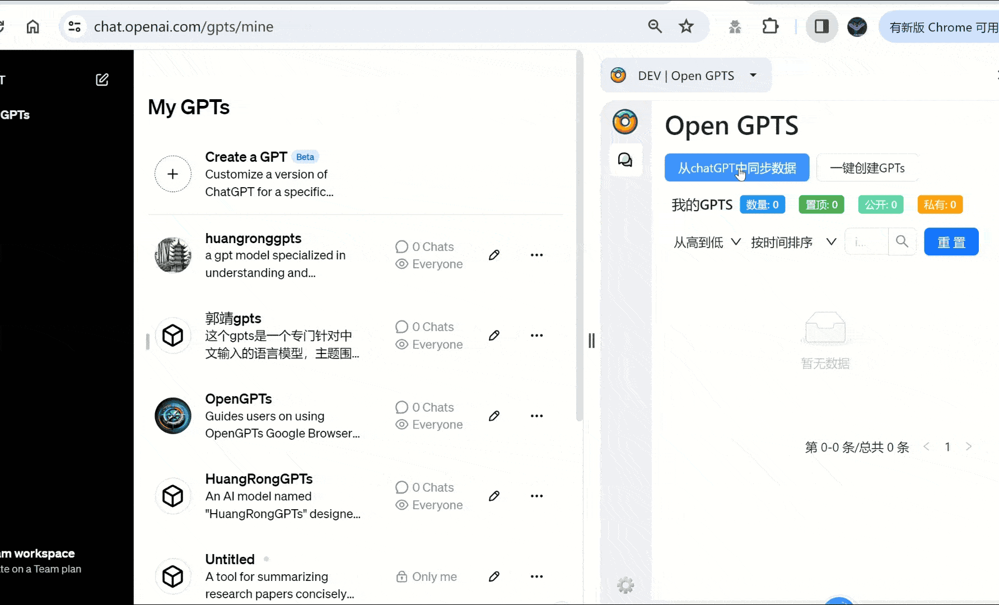

<a name="readme-top"></a>

<div align="center">

<div align="center">

</div>


# OpenGPTs

OpenGPTs is an open-source browser plugin that supports voice input, function calls, multiple models, multimodality, batch conversation, and can be invoked on the web or through an API key. <br/>
We hope that this plugin can help you use GPT more efficiently and even replace you in controlling web pages to achieve various robot automation (RPA) operations. <br/>

**English** · [简体中文](./README_ZH.md) · [Changelog](./changeLog.md) · [Report Bug][github-issues-link] · [Request Feature][github-issues-link]
</br>

<!-- SHIELD GROUP -->

[![][github-release-shield]][github-release-link]
[![][vercel-shield]][vercel-link]

[![][github-releasedate-shield]][github-releasedate-link]
[![][github-contributors-shield]][github-contributors-link]
[![][github-forks-shield]][github-forks-link]
[![][github-stars-shield]][github-stars-link]<br>
[![][github-issues-shield]][github-issues-link]
[![][github-license-shield]][github-license-link]<br>

**Share OpenGPTs Repository**

[![][share-x-shield]][share-x-link]
[![][share-telegram-shield]][share-telegram-link]
[![][share-whatsapp-shield]][share-whatsapp-link]
[![][share-reddit-shield]][share-reddit-link]
[![][share-weibo-shield]][share-weibo-link]
[![][share-mastodon-shield]][share-mastodon-link]
[![][share-linkedin-shield]][share-linkedin-link]

</div>

## Donation
<div>
  
</div>

 302.AI是一个汇集全球顶级品牌的AI超市，按需付费，零月费，零门槛使用各种类型AI。

功能全面: 将最好用的AI集成到在平台之上，包括不限于AI聊天，图片生成，图片处理，视频生成，全方位覆盖。
简单易用: 提供机器人，工具和API多种使用方法，可以满足从小白到开发者多种角色的需求。
按需付费零门槛: 不提供月付套餐，对产品不设任何门槛，按需付费，全部开放。充值余额永久有效。
管理者和使用者分离： 管理者一键分享，使用者无需登录。


## 👋🏻 Getting Started and Introduction

There are not many open-source GPT browser plugins, but I think browser plugins are a good form for AI at present, so we decided to develop one.

After using many AI plugins, such as Sider, Mocia, ChatALL, ChatGPTBox, GPTs Store, etc., I hope to write a plugin that can combine the strengths of various plugins and extract the essence. -ChatPaper team

- Download: [Plugin Link]("https://github.com/hzeyuan/OpenGPTS/releases/download/v0.0.1-beta/OpenGPTs.v0.0.3.zip")
- Issues: If you have any requirements or questions, you can ask on [issues][github-issues-link], and we will actively deal with and solve them.
- Development: 👏🏻 Welcome any friends to participate, you can check [here](#development-guide) for development information.
- Contact: Please join our QQ group: 860859251, email: yixotieq@gmail.com

**Ambition**: Our ultimate goal is to use this plugin as a platform 📈 and treat each GPT as an Agent 🤖 to automate various business processes, maximize everyone's productivity 🚀, and help everyone to "fish" better! Haha! 😄

If this project is helpful to you, welcome to click the Star🌟 above, welcome to repost, this is the greatest support to us! 🙌

If you have any questions, please feel free to raise an issue💬. If you have new features, welcome everyone to submit a PR. You are also welcome to join our developer group: 860859251.👩‍💻

## Why do OpenGPTs? 🤔💡

<details><summary><code><b>1. Some thoughts on AI applications</b></code></summary>

- Web pages have limited permissions on browsers, but plugins can modify any page, so I think plugins are a great form for AI products.
- I am discussing repetitive work. As a developer, every time I open F12, it is repetitive work~, at this time I will fantasize about whether AI can solve some things for me.
- - Can GPT help me handle network requests to facilitate better data crawling?
- - Can GPT manipulate the DOM to help me perform some fixed operations, such as automatically tweeting, automatically liking B站 (bilibili) videos? Or meet various strange requirements of people (the key is to let GPT generate these scripts)
- - In the era of AIGC, can there be an AI version of the plugin system with various plugins on it, such as ad blocking, or even changing the appearance of web pages, so that everyone has a unique website.

</details>

<details><summary><code><b>2. About wrapping ChatGPT (products like ChatGPT)</b></code></summary>

### Wrapping is not shameful, and wrapping to the extreme is awesome.

ChatGPT is very powerful, but I think the product interaction of ChatGPT can be better, and sometimes there are many places to complain.
Instead of waiting for OpenAI to update, it is better to do it yourself and meet your own requirements. Combined with plugins, various effects can be achieved.

- Screenshots can be directly submitted instead of saving images and submitting them to the web page.
- Multiple GPTs can converse simultaneously, without having to switch one by one.
- Is it possible for @ function to share dialogues between GPTs, call each other, instead of pasting the output from one GPT to the next?
- Multiple windows at the same time, such as having 6 windows on a webpage, instead of only one fixed window.
- Automatic speech playback for dialogues, with selectable voice tones.
- Direct integration of multiple large models, including Claude2 GPT3.5, Gemini pro, can be accessed on the web.

There are many other useful features.

</details>

## 2. ✨ Highlight Features:

### 2.1 GPTs Module

|     Feature     |                                                        Description                                                         | Done |
| :-------------: | :-----------------------------------------------------------------------------------------------------------------------: | :--: |
|    Sync All     |                           Automatically sync all data from the official GPTs website: dialogues, favorites, users                            |  ✅  |
|  Batch Manage   |            Batch manage all your GPTs: custom sort; batch delete; query search; publish to store with one click; copy to clipboard            |  ✅  |
|   One Click     |                    Input title, generate GPTs with one click, replicate official website functions, but with custom prompts! (upcoming API)                     |  ✅  |
|   One Click Replicate     |        For your own existing GPTs, one click to replicate into different languages or fine-tune other versions by adjusting the language.          |  ✅  |
| Batch Delete GPT Dialogues | We have provided a batch delete feature for OpenAI chat dialogues, inspired by [chatGPTBox](https://github.com/josStorer/chatGPTBox). This feature is a major pain point! |  ✅  |
|   Multi-GPTs Calls   |                                     Input once, make multiple model calls simultaneously, quickly compare results.                                      |  ✅  |
|    Leaderboard    | Inspired by [gpts-works](https://github.com/all-in-aigc/gpts-works), we hope to provide a more comprehensive and accurate leaderboard for users to better choose and promote their own GPTs. |  ✅  |
|   Better UI    |                                                Provide a more attractive UI and more user-friendly interaction mode                                                 |  ✅  |

### 2.2 Chat Module

|      Feature      |                                                  Description                                                   | Done |
| :---------------: | :-----------------------------------------------------------------------------------------------------------: | :--: |
|  Multi-GPTs Chat  |                   Chat with multiple GPT models at the same time, no need to switch one by one, improve interaction efficiency                   |  ✅  |
|     @Any GPTs, Model    |      GPTs and models can share conversation content, call and share information quickly, avoid duplicate input      |  ✅  |
|  Multiple Windows  |                        Open multiple windows in one interface, perform multiple tasks simultaneously, improve efficiency                         |  ✅  |
| Web-based ChatGPT Calling  |                    Allow the plugin to directly call ChatGPT, GPT3.5, GPT4.0 on the web.                       |  ✅  |
|    ChatGPT API Key Calling   |                          Use API key to call GPT3.5, GPT4.0                          |  ✅  |
|       Chat History Management        |                              Provide chat history management and search functionality                               |  ✅  |
|    /Presets      |                          Provide quick operations and custom preset options                           |  ✅  |
|    Generate Flowchart (mermaid)     |                                         Support outputting flowcharts                                          |  ✅  |
|      Speech Playback       |                                 Convert conversation content to speech and play automatically                                  |  ❌  |
|     Submit Screenshots      |                     Submit screenshots directly in the chat interface without the need to save and upload first                      |  ❌  |
|    Web-based Claude Calling     |                                  Allow the plugin to directly call Claude on the web                                   |  ❌  |
| Web-based Gemini Pro Calling  |                                Allow the plugin to directly call Gemini Pro on the web                                 |  ❌  |
|    Flowchart Generation         |                      Automatically generate visual content such as flowcharts or concept maps from descriptions                       |  ❌  |
|       Function Calling        |                             Directly call specific functions or services through the command line                              |  ❌  |
|     Multi-modal Input      |                          Support text, image, audio, and other input modes                           |  ❌  |


### 2.3 UI Common

|   Feature    |                   Description                   | Done |
| :----------: | :-------------------------------------------: | :--: |
| Dark/Light Mode | Provide dark/light mode for convenient use in different environments |  ✅  |
|  Multi-language Support   | Provide multi-language support for users in different language environments |  ✅  |

### 2.4 Knowledge Base Management, Folder System Modal

#### Not available

### 2.5 RPA Automatic Script Execution, Agent WorkFlow

#### Not available

## Simple Installation Steps:

- Open the [OpenAI website](https://chat.openai.com/) and log in to your OpenAI account to have a conversation with GPTs. Please note that you need Plus permissions for this.
- Download the [browser compression package](https://github.com/hzeyuan/OpenGPTS/releases/download/v0.0.1-beta/OpenGPTs.v0.0.1-beta.zip).
- Unzip it to your local machine.
- Open the browser's plugin management page.
- Import the extracted folder.
- Open the plugin and select the corresponding functionality.

Installation video:

<div align="center">

</div>

## Specific Function Introduction:

<details><summary><code><b>One-click synchronization:</b></code></summary>

### One-click synchronization:

If you only have a few GPTs, you may not feel any inconvenience. But if you have more than ten GPTs to maintain, the interaction on the official website can be annoying. When you open [mygpts](https://chat.openai.com/gpts/mine), you can only see ten of them and you cannot search. You can only click "Load More" one by one.

As a manager, we provide the first function of GPTs synchronization for you to facilitate batch management later.

The specific steps are as follows:

1. Log in to your esteemed OpenAI Plus account and click on our plugin, then click "Sync Data from ChatGPT".
2. Wait for the data synchronization to complete.
3. If you want to temporarily interrupt the synchronization, you can close the sidebar and then reopen it.



</details>

<details><summary><code><b>Batch management of all GPTs:</b></code></summary>

### Batch management of all GPTs:

Alright, this function is to solve the pain points we mentioned earlier, such as how to manage a large number of GPTs in batches.

Below, we will explain in detail several functions: custom sorting, batch deletion, query search, one-click publication to the store, and one-click copying to the clipboard (title + summary + link).

</details>

<details><summary><code><b>Custom sorting:</b></code></summary>

#### Custom sorting:

Currently, the evaluation of GPTs on the official website and some leaderboards mainly depends on the number of conversations. For GPTs creators, the number of conversations is definitely an important indicator they care about the most. However, if your most popular GPTs was created a long time ago, it can be difficult to find when you need to maintain it. This is where custom sorting comes in handy:

1. Choose the sorting metric, for example, "Sort by chat".
2. Choose the sorting order, for example, "High to low".

This way, you can happily see how many people have used your GPTs and which ones are more popular.

<div align="center">

</div>

</details>

<details><summary><code><b>Batch deletion: Use with caution!</b></code></summary>

#### Batch deletion: Use with caution!

If you have created a bunch of GPTs that are not useful, especially during testing and you need to quickly delete them, we provide the function of batch deletion. However, this function currently does not have a recycle bin option. **Make sure not to accidentally delete important GPTs!**

1. Choose a suitable sorting, such as "Sort by chat" and then "Low to high", or "Sort by creation" and then "High to low".
2. Select the GPTs you want to delete.
3. Swipe to the top and select "Delete". Make sure that it is deletable, as it cannot be undone! OpenAI will not retain any records either!

<div align="center">

</div>
<!--  -->

</details>

<details><summary><code><b>Query search:</b></code></summary>

#### Query search:

#### Introduction:

This is a simple keyword search tool, which should be very convenient.

Below is the effect of the search:

<div align="center">

</div>
<!--  -->

</details>

<details><summary><code><b>One-click Publish to Store;</b></code></summary>

#### One-click Publish to Store;

By default, the creation of GPTs is for personal use, i.e. "only me". However, if you want to publish it to OpenAI's store or to our OpenGPTs leaderboard for better promotion, you can do so with just one click.

1. Select a "private" GPTs
2. Click the cloud icon on the right to publish to OpenAI GPTs store
3. Click the airplane icon in the middle to publish to our OpenGPTs store

<div align="center">

</div>
<!--  -->

</details>

<details><summary><code><b>One-click Share with Amazing Friends</b></code></summary>

#### One-click Share with Amazing Friends

We don't know yet who foreign friends usually share with, Twitter? Discord? But in China, friends usually share their well-trained GPTs directly with amazing friends. Compared to OpenAI's standalone URL copy, our one-click sharing feature eliminates multiple copying and pasting, allowing you to paste the "title + description + link" all at once, making it simple and hassle-free.

<!--  -->
<div align="center">

</div>

</details>

<details><summary><code><b>One-click Generate GPTs:</b></code></summary>

### One-click Generate GPTs:

This is a hidden, game-changing feature. It looks a bit simple and rough right now, but we have already automated the process of creating GPTs in batches. Imaginative users should know what this feature means when OpenAI starts giving rebates to GPTs creators.

Haha, let's not make any promises for now. Let's first describe the existing features briefly: 0. You need to open any GPTs first for a conversation, otherwise this feature cannot automatically provide logo drawing!

1. Click on "One-click Create GPTs"
2. Enter the desired features of your GPTs, for example: "Catgirl GPTs"
3. Choose the additional abilities your GPTs needs, such as internet connection, drawing, code interpreter (default: first two)
4. Click "Confirm" and wait for the generation, which takes about 2 minutes to create a GPTs due to the drawing part.
5. Once the generation is complete, click on the OpenAI icon on the left to view the generated result page.
6. If the difference is not significant, you can publish it directly; if there are some minor issues, you can manually modify it (currently there is a small problem with "start").
7. After making the modifications, it is only visible to yourself by default. You can choose the upload icon on the right to make it public in the OpenAI store.
8. Automatic creation of files and actions is currently not supported.

<!--  -->
<div align="center">

</div>

</details>

<details><summary><code><b>One-click Replicate to Other Languages</b></code></summary>

## One-click Replicate to Other Languages

It is well known that there are many languages in the world. If you create a very popular GPTs, you definitely want to make it available to native speakers of other languages. Therefore, we provide the "One-click Replicate to Other Languages" feature:

1. Click on the "文/A" icon
2. Select the target language
3. Click "Confirm" and wait for about ten seconds.

</details>


## One-Click Calling of GPTs Dialogue


Reference Video:
[【开源,免费,白嫖ChatGPT:6倍效率提供的AI插件】](https://www.bilibili.com/video/BV1u5411C74D)


## Privacy:

All data is saved locally on the user's device. No data will be uploaded unless the user manually submits GPTs links to the leaderboard.

## Technology Used

- [plasmo - Google Chrome Extension Development Framework](https://github.com/PlasmoHQ/plasmo)
- React
- Ant Design (antd) & Tailwind CSS
- Next.js

## Development Guide:

Please refer to the [Setup Document](./SETUP.md) for detailed instructions.

### Installation

#### Copy the project to a specified directory:

```
git clone git@github.com:hzeyuan/OpenGPTS.git
```

#### Install dependencies in the root directory:

```
pnpm install
```

#### Plugin Development

```
npm run dev:ext
```

For any doubts related to this, please refer to the [plasmo docs](https://docs.plasmo.com/framework)

#### If the build is successful, you will find a directory named chrome-mv3-dev in apps/extension/build. Drag and drop this directory into the Extensions page in Chrome.

#### Now you can start your development!

#### Website Development

```
npm run dev:web
```

## Todo List

- [ ] Automatically optimize prompts
- [ ] One-Click Calling of GPTs Dialogue
- [ ] Multiple GPTs Dialogues
- [ ] Development tutorial
- [ ] Option to hide individual input boxes when batch dialogues are selected
- [ ] Multiple dialog box inputs and outputs can be orchestrated.
- [ ] Select the GPTs that can be mentioned in the GPTs management interface, and then input "@" in the dialog box to select the desired GPTs for the conversation.

## Credits:

Special thanks to the following projects and contributors:

- [gpts-works](https://github.com/all-in-aigc/gpts-works)
- [chatGPTBox](https://github.com/josStorer/chatGPTBox)

## Thanks to all contributors for their efforts

- [hzeyuan](https://github.com/hzeyuan): Responsible for 90% of the development work, the main initiator of the project.
- [kaixindelele](https://github.com/kaixindelele): Responsible for part of the product design, testing, project PR, a few development work, co-initiator of the project.

## Starchart

[](https://star-history.com/#hzeyuan/OpenGPTS&Date)

## Project Reference:

Please cite the repository if you use the data or code in this repository.

```
@misc{OpenGPTs,
  author={Zeyuan Huang, Yongle Luo},
  title = {OpenGPTs: A Powerful GPTs manager, Multi-GPTs Intelligent Agent Platform.},
  year = {2024},
  publisher = {GitHub},
  journal = {GitHub repository},
  howpublished = {\url{https://github.com/hzeyuan/OpenGPTs}},
}
```

## License

GPL-3.0 License

[github-issues-link]: https://github.com/hzeyuan/OpenGPTS/issues
[github-release-shield]: https://img.shields.io/github/v/release/hzeyuan/OpenGPTS?color=369eff&labelColor=black&logo=github&style=flat-square
[github-release-link]: https://github.com/hzeyuan/OpenGPTS/releases
[github-contributors-shield]: https://img.shields.io/github/contributors/hzeyuan/OpenGPTS?color=c4f042&labelColor=black&style=flat-square
[github-contributors-link]: https://github.com/hzeyuan/OpenGPTS/graphs/contributors
[github-contributors-shield]: https://img.shields.io/github/contributors/hzeyuan/OpenGPTS?color=c4f042&labelColor=black&style=flat-square
[github-forks-link]: https://github.com/hzeyuan/OpenGPTS/network/members
[github-forks-shield]: https://img.shields.io/github/forks/hzeyuan/OpenGPTS?color=8ae8ff&labelColor=black&style=flat-square
[github-issues-link]: https://github.com/hzeyuan/OpenGPTS/issues
[github-issues-shield]: https://img.shields.io/github/issues/hzeyuan/OpenGPTS?color=ff80eb&labelColor=black&style=flat-square
[github-license-link]: https://github.com/hzeyuan/OpenGPTS/blob/main/LICENSE
[github-license-shield]: https://img.shields.io/github/license/hzeyuan/OpenGPTS?color=white&labelColor=black&style=flat-square
[github-stars-link]: https://github.com/hzeyuan/OpenGPTS/network/stargazers
[github-stars-shield]: https://img.shields.io/github/stars/hzeyuan/OpenGPTS?color=ffcb47&labelColor=black&style=flat-square
[github-releasedate-link]: https://github.com/hzeyuan/OpenGPTS/releases
[github-releasedate-shield]: https://img.shields.io/github/release-date/hzeyuan/OpenGPTS?labelColor=black&style=flat-square
[vercel-link]: https://open-gpts.vercel.app
[vercel-shield]: https://img.shields.io/website?down_message=offline&label=vercel&labelColor=black&logo=vercel&style=flat-square&up_message=online&url=https%3A%2F%2Fyour-vercel-app.vercel.app
[share-linkedin-link]: https://linkedin.com/feed
[share-linkedin-shield]: https://img.shields.io/badge/-share%20on%20linkedin-black?labelColor=black&logo=linkedin&logoColor=white&style=flat-square
[share-mastodon-link]: https://mastodon.social/share?text=Check%20this%20GitHub%20repository%20out%20%F0%9F%A4%AF%20OpenGPTs%20-%20Powerful%20GPTs%20Colipot%20%7C%20Strong%20gpt%20browser%20extension%20%7C%20Multi-window%20%7C%20Batch%20conversation%20%7C%20chatgpt3.5%20%7C%20chatgpt4.0%20https%3A%2F%2Fgithub.com%2Fhzeyuan%2FOpenGPTS
[share-mastodon-shield]: https://img.shields.io/badge/-share%20on%20mastodon-black?labelColor=black&logo=mastodon&logoColor=white&style=flat-square
[share-reddit-link]: https://www.reddit.com/submit?title=Check%20this%20GitHub%20repository%20out%20%F0%9F%A4%AF%20OpenGPTs%20-%20Powerful%20GPTs%20Colipot%20%7C%20%E5%BC%BA%E5%A4%A7%E7%9A%84gpts%E6%B5%8F%E8%A7%88%E5%99%A8%E6%8F%92%E4%BB%B6%7C%E5%A4%9A%E7%AA%97%E5%8F%A3%7C%E6%89%B9%E9%87%8F%E5%AF%B9%E8%AF%9D%7Cchatgpt3.5%7Cchatgpt4.0&url=https%3A%2F%2Fgithub.com%2Fhzeyuan%2FOpenGPTS
[share-reddit-shield]: https://img.shields.io/badge/-share%20on%20reddit-black?labelColor=black&logo=reddit&logoColor=white&style=flat-square
[share-telegram-link]: https://t.me/share/url?text=Check%20this%20GitHub%20repository%20out%20%F0%9F%A4%AF%20OpenGPTs%20-%20Powerful%20GPTs%20Colipot%20%7C%20%E5%BC%BA%E5%A4%A7%E7%9A%84gpts%E6%B5%8F%E8%A7%88%E5%99%A8%E6%8F%92%E4%BB%B6%7C%E5%A4%9A%E7%AA%97%E5%8F%A3%7C%E6%89%B9%E9%87%8F%E5%AF%B9%E8%AF%9D%7Cchatgpt3.5%7Cchatgpt4.0&url=https%3A%2F%2Fgithub.com%2Fhzeyuan%2FOpenGPTS
[share-telegram-shield]: https://img.shields.io/badge/-share%20on%20telegram-black?labelColor=black&logo=telegram&logoColor=white&style=flat-square
[share-weibo-link]: http://service.weibo.com/share/share.php?sharesource=weibo&title=Check%20this%20GitHub%20repository%20out%20%F0%9F%A4%AF%20OpenGPTs%20-%20Powerful%20GPTs%20Colipot%20%7C%20%E5%BC%BA%E5%A4%A7%E7%9A%84gpts%E6%B5%8F%E8%A7%88%E5%99%A8%E6%8F%92%E4%BB%B6%7C%E5%A4%9A%E7%AA%97%E5%8F%A3%7C%E6%89%B9%E9%87%8F%E5%AF%B9%E8%AF%9D%7Cchatgpt3.5%7Cchatgpt4.0%20https%3A%2F%2Fgithub.com%2Fhzeyuan%2FOpenGPTS
[share-weibo-shield]: https://img.shields.io/badge/-share%20on%20weibo-black?labelColor=black&logo=sinaweibo&logoColor=white&style=flat-square
[share-whatsapp-link]: https://api.whatsapp.com/send?text=Check%20this%20GitHub%20repository%20out%20%F0%9F%A4%AF%20OpenGPTs%20-%20Powerful%20GPTs%20Colipot%20%7C%20%E5%BC%BA%E5%A4%A7%E7%9A%84gpts%E6%B5%8F%E8%A7%88%E5%99%A8%E6%8F%92%E4%BB%B6%7C%E5%A4%9A%E7%AA%97%E5%8F%A3%7C%E6%89%B9%E9%87%8F%E5%AF%B9%E8%AF%9D%7Cchatgpt3.5%7Cchatgpt4.0%20https%3A%2F%2Fgithub.com%2Fhzeyuan%2FOpenGPTS
[share-whatsapp-shield]: https://img.shields.io/badge/-share%20on%20whatsapp-black?labelColor=black&logo=whatsapp&logoColor=white&style=flat-square
[share-x-link]: https://x.com/intent/tweet?hashtags=chatbot%2CchatGPT%2CopenAI&text=Check%20this%20GitHub%20repository%20out%20%F0%9F%A4%AF%20OpenGPTs%20-%20Powerful%20GPTs%20Colipot%20%7C%20%E5%BC%BA%E5%A4%A7%E7%9A%84gpts%E6%B5%8F%E8%A7%88%E5%99%A8%E6%8F%92%E4%BB%B6%7C%E5%A4%9A%E7%AA%97%E5%8F%A3%7C%E6%89%B9%E9%87%8F%E5%AF%B9%E8%AF%9D%7Cchatgpt3.5%7Cchatgpt4.0&url=https%3A%2F%2Fgithub.com%2Fhzeyuan%2FOpenGPTS
[share-x-shield]: https://img.shields.io/badge/-share%20on%20x-black?labelColor=black&logo=x&logoColor=white&style=flat-square
