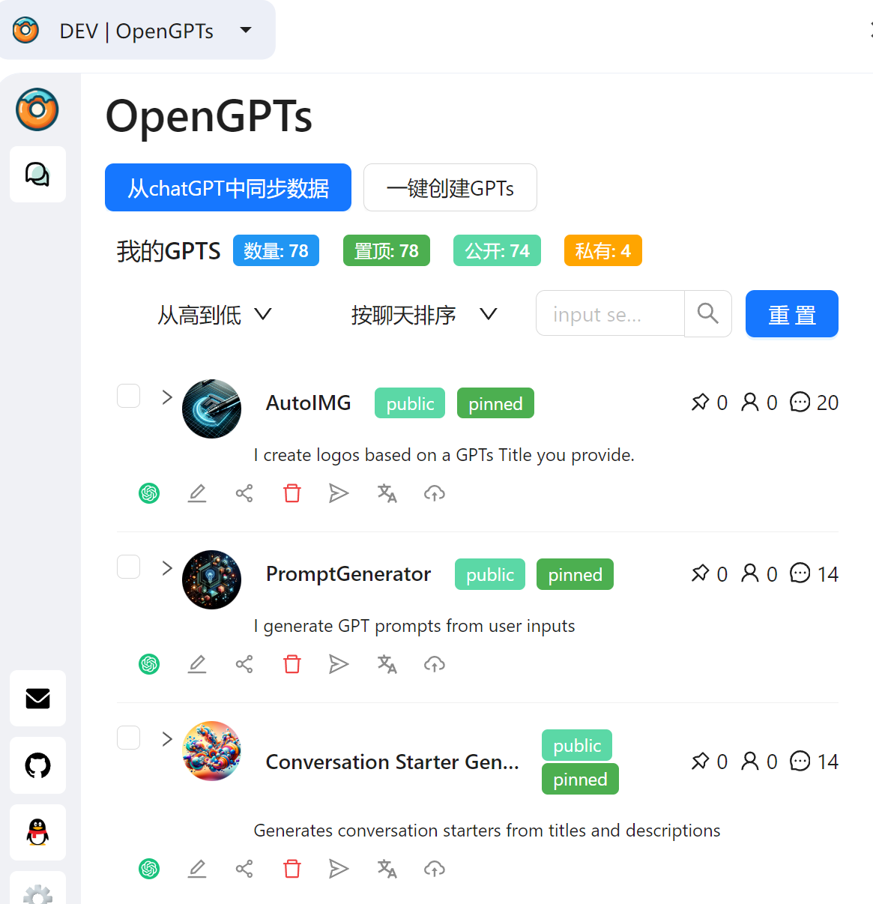
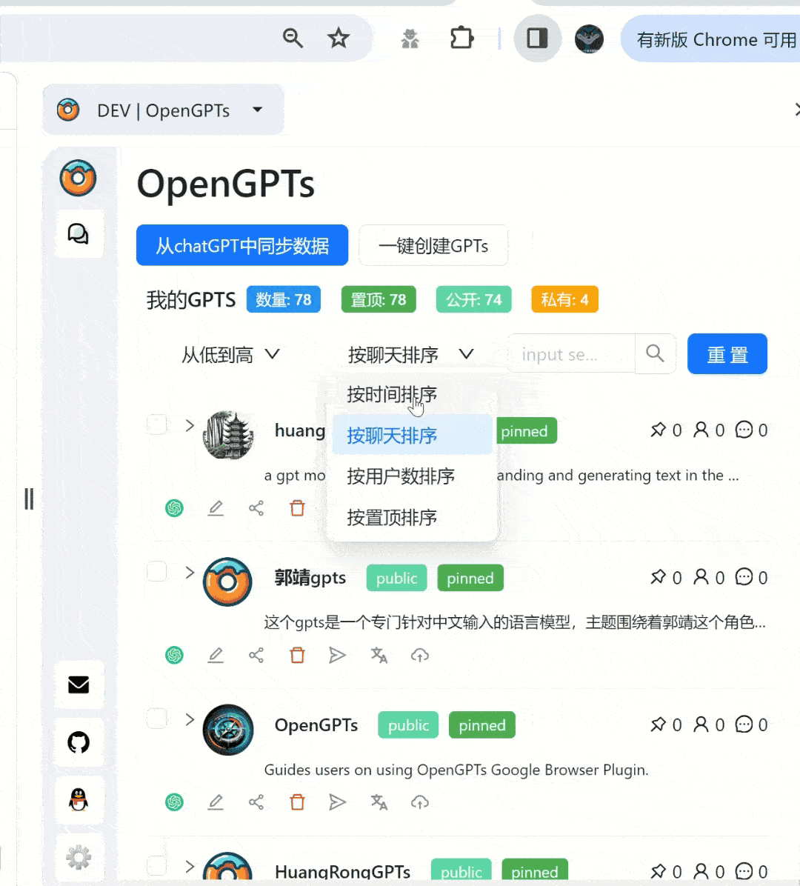
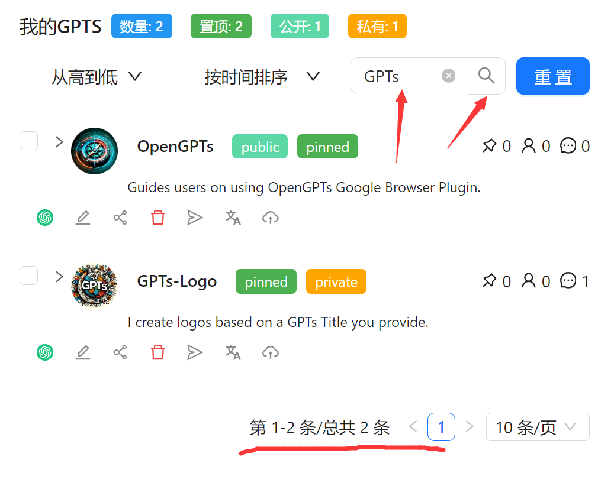
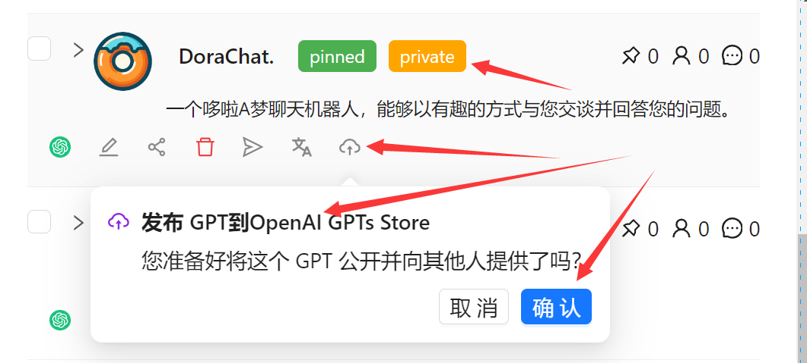
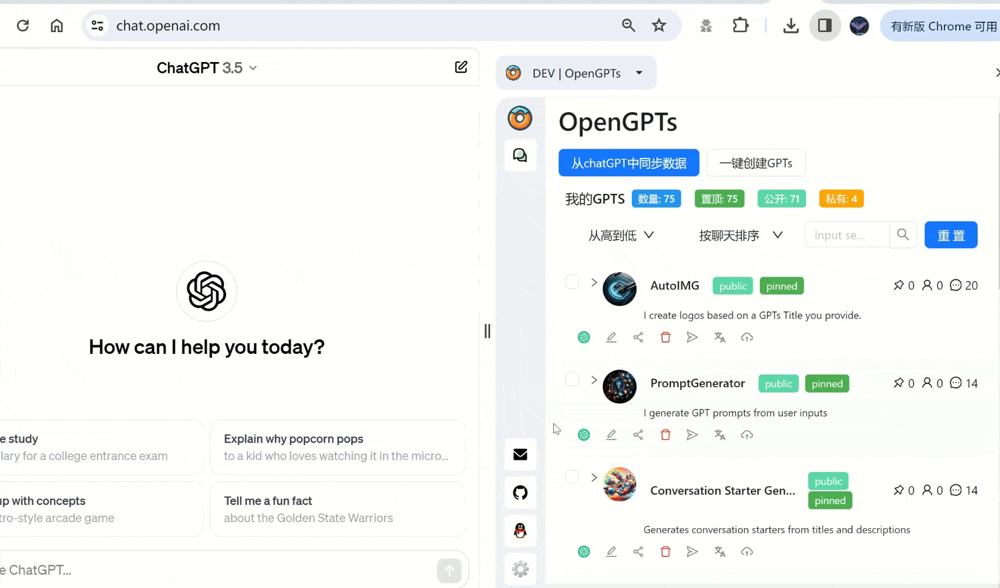
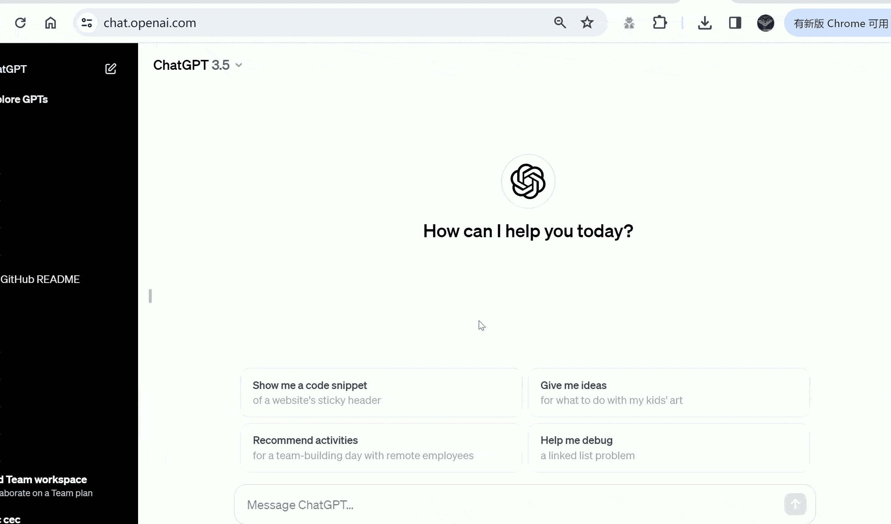

# OpenGPTs-非常好用的开源GPTs管理器.

## 一句话介绍
非常好用的GPTs管理器，[ChatPaper](https://github.com/kaixindelele/chatpaper)团队开源一款功能强大的浏览器插件，适合所有拥有Plus权限的朋友。

## 为什么要做OpenGPTs？ 🤔💡
众所周知，OpenAI官网的GPTs几乎没有管理功能。如果你创建了几个GPTs，你应该会想着今天有多少人使用过你的GPTs，你想要能够一键分享给群友，你希望能够产生不同的微调版本。🔁

但是！这些功能在官网上只能手动去做！😩🖐️

这种重复性的工作，能不能让浏览器自动帮你完成？🤖⚙️

为此，我们团队花了一周时间，特意为大家开发了一款强大的浏览器插件--OpenGPTs，它可以帮助大家更好的管理自己的GPTs。💻🚀 我们不仅将完整的插件免费发布，并且将所有插件代码开源出来，希望以此为平台为基础，和广大的开发者们一起，做出更好的、更强大的插件管理器。🌍❤️️

**野望**：我们的最终设想是希望能够以这个插件为平台📈，把**每个GPTs当成一个Agent**🤖，实现各种业务流程的自动化，最大程度解放大家的生产力🚀，帮助大家更好的摸鱼🐟！哈哈！😄

如果本项目对大家有帮助，欢迎点一下上面的Star🌟，欢迎转发，这是对我们最大的支持！🙌

转发文案：
```css
OpenGPTs：一款外挂般的GPTs管理器，由ChatPaper团队开源！
亮点功能：一键同步，自定义排序搜索，一键创建，一键复刻到其他语言，一键分享，等等功能。还有多GPTs对话等功能正在开发ing。
Chrome插件下载链接：
Github仓库：https://github.com/hzeyuan/OpenGPTS
欢迎大家star🌟和转发！🔁
```

如果有任何问题，欢迎提issue💬，如果有新的功能，欢迎大家提PR。也欢迎加入我们的开发者群：860859251。👩‍💻


## 2. 亮点功能：
|功能名称|功能描述|
|:-:|:-:|
|一键同步|自动同步官网GPTs所有数据：对话数，收藏数，用户数|
|批量管理|批量管理自己的所有GPTs：自定义排序；批量删除；查询搜索；一键发布到商店；一键复制到剪切板（标题+简介+链接）|
|一键生成|输入标题，一键生成GPTs，复刻官网功能，但可以自定义提示词！（后续封装出接口）|
|一键复刻|对自己已有GPTs，一键复刻成其他语言，或者通过语言调整其他微调版本|
|批量删除GPT对话|参考[chatGPTBox](https://github.com/josStorer/chatGPTBox)，我们为大家提供了批量删除OpenAI对话的功能，这个功能实在是太痛点了！|
|一键调用GPTs对话|目前版本已经实现调用3.5/4.0和任意GPTs对话的功能，后续将封装成模块，供大家定制化开发！|
|排行榜|参考[gpts-works](https://github.com/all-in-aigc/gpts-works)，我们希望提供一个更加全面和准确的排行榜，让大家更好的选择和推广自己的GPTs|
|更漂亮UI|提供更漂亮的UI和更便捷的交互模式|


## 极简安装步骤：
- 打开[OpenAI官网](https://chat.openai.com/)，登录你的OpenAI账号，进行一次GPTs的对话，注意，这里需要有Plus的权限。
- 下载浏览器压缩包
- 解压到本地
- 打开浏览器的插件管理页面
- 导入解压后的文件夹
- 打开插件，选择对应的功能

## 具体功能介绍：

### 一键同步：
如果大家的GPTs的数量只有几个可能不会有什么痛感，但如果维护的数量超过十个，就会讨厌官网的交互，打开[mygpts](https://chat.openai.com/gpts/mine)，你只能看到10个，你没有办法搜索，你只能一次一次的点击`Load More`。

作为管理器，我们为大家提供的第一个功能就是GPTs的同步，以便后面的批量管理。

具体操作如下：
1. 登录您尊贵的OpenAI Plus账号，然后点开我们的插件，点击`从ChatGPT中同步数据`
2. 等待数据同步完成
3. 如果想临时中断同步，可以关闭侧边栏，再打开。


### 批量管理所有GPTs：
好了，这个功能就是为了解决我们之前提到的那些痛点，如何批量管理比较多的GPTs。

下面依次详细介绍 自定义排序；批量删除；查询搜索；一键发布到商店；一键复制到剪切板（标题+简介+链接）这几个功能。

#### 自定义排序：
现在官网和一些排行榜对GPTs的评价主要看对话数，对于GPTs的创作者来说，对话数肯定是自己最看重的一个指标，但如果自己最火的一个GPTs在很久之前创建的，那么去维护它的时候，就很难找到了。这时候，速速使用自定义排序：
1. 选择排序指标，比如说`按聊天排序`
2. 选择排序规则，比如说`从高到低`

这样就可以开心的看到自己的GPTs有多少人用过，哪些是比较受大家欢迎的。
<div align="center">

</div>
<!--  -->

#### 批量删除：慎用！
如果大家创建了一堆没啥用的GPTs，尤其是测试的时候，需要快速删除掉，我们也提供了批量删除的功能，不过这个功能暂时没有回收站的选项，**千万别误删除了重要的GPTs！**

1. 选择合适的排序，比如说`按聊天排序`，然后`从低到高`，或者`按创建排序`，然后`从高到低`。
2. 选择要删除的GPTs；
3. 划到上面，选择`删除`，一定要确保是能删除的，无法撤回！OpenAI那边也不会保留记录！

<div align="center">

</div>
<!--  -->

#### 查询搜索：
这个没啥介绍的，就是简单的关键词搜索，但应该还是很方便的。
下面是搜索的效果图：
<div align="center">

</div>
<!--  -->

#### 一键发布到商店；
我们默认GPTs的创建是用户本人使用的，即`only me`这种，但如果你需要发布到OpenAI的商店，或者为了扩大宣传，发布到我们OpenGPTs的排行榜，那么就可以一键发布了。
1. 选择一个`privite`的GPTs
2. 点击最右边的小云朵，发布到OpenAI GPTs store中
3. 点击中间的小飞机，发布到我们的OpenGPTs store中

<div align="center">

</div>
<!--  -->

#### 一键分享给神奇的群友
暂时还不知道国外的朋友们一般会分享给谁，推特？discord？国内的朋友们应该都是直接选择将自己精心调教的GPTs，分享给神奇的群友。相比OpenAI自带的、孤零零的URL复制，我们提供的一键分享功能，则免去的多次复制粘贴，一次性粘贴出`标题+简介+链接`，简单省心。
<!--  -->
<div align="center">

</div>


### 一键生成GPTs：
这是一个隐藏的、开挂般的功能，现在看起来还有点简单粗陋，但我们已经把自动批量创建GPTs的链条打通，想象力丰富的朋友应该知道，这个功能在后面openai给GPTs创作者返利的时候意味着什么。

哈哈，先不画饼了，先简单描述一下现有的功能：
0. 需要先打开任意一个GPTs，进行对话，否则本功能无法自动提供Logo绘制！
1. 点击`一键创建GPTs`
2. 输入你想要的GPTs有的特性，比如：`猫娘GPTs`
3. 选择GPTs需要的附加能力，是否需要联网、画图、代码解释器，默认前两个
4. 点击`确认`，等待生成，由于需要等待画图，那么需要大约2分钟左右，生成一个GPTs.
5. 生成完毕后，点击左边的openai图标，查看生成结果网页。
6. 如果差距不大，可以直接发布；如果有一些细节问题，可以手动修改（目前的start有点小问题）。
7. 修改完毕后，默认是仅自己可见。可以选择最右边的上传图标，在OpenAI商店公开。
8. 暂时不支持对文件和action的自动创建。

<!--  -->
<div align="center">

</div>

## 一键复刻到其他语言
总所周知，全世界有很多种语言，如果你创建了一个很火的GPTs，那么你肯定希望能够让其他母语的使用者也能使用这个GPTs，因此，我们提供了`一键复刻到其他语言`的功能：
1. 点击`文/A`图标
2. 选择目标语言
3. 点击`确认`，等待十几秒

## 一键调用GPTs对话
这个功能正在开发中，欢迎大家一起来添砖加瓦！


## 隐私：
所有数据保存在用户本地，除非用户手动提交GPTs链接到排行榜，否则不会上传任何数据。

## 技术介绍：
javascipt; react;

## 开发指导：


## Todo List
- [ ] 自动优化提示词
- [ ] 一键调用GPTs对话
- [ ] 多GPTs对话


## Credits:
Special thanks to the following projects and contributors:

- [gpts-works](https://github.com/all-in-aigc/gpts-works)
- [chatGPTBox](https://github.com/josStorer/chatGPTBox)


## Thanks to all contributors for their efforts
- [hzeyuan](https://github.com/hzeyuan)，负责9成9的开发工作，主要的项目发起者。
- [kaixindelele](https://github.com/kaixindelele)， 负责部分产品设计，测试，项目PR，极少数开发，项目联合发起者。

## Starchart

[](https://star-history.com/#hzeyuan/OpenGPTS&Date)


## 项目引用：
Please cite the repo if you use the data or code in this repo.

```
@misc{OpenGPTs,
  author={Zeyuan Huang, Yongle Luo},
  title = {OpenGPTs: A Powerful GPTs manager, Multi-GPTs Intelligent Agent Platform.},
  year = {2024},
  publisher = {GitHub},
  journal = {GitHub repository},
  howpublished = {\url{https://github.com/hzeyuan/OpenGPTs}},
}
```


## License
GPL-3.0 License
