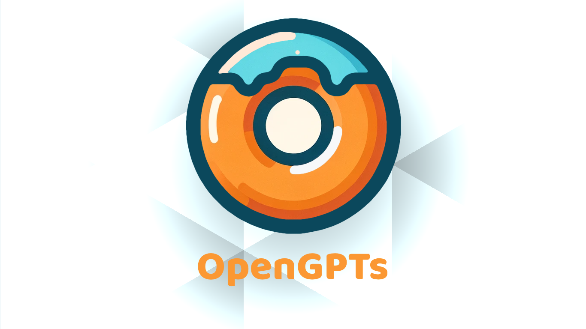
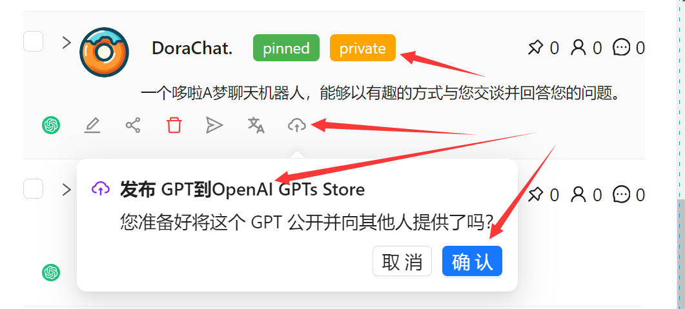

# OpenGPTs - An Incredible Open Source GPTs Manager

<div style="font-size: 1.5rem;">
  <a href="./README.md">中文</a> |
  <a href="./README_EN.md">English</a>
</div>
</br>


<div align="center">

</div>

## One-Sentence Introduction
OpenGPTs is an amazing GPTs manager. It is a powerful browser extension developed by the [ChatPaper](https://github.com/kaixindelele/chatpaper) team and is suitable for all friends with Plus permissions.

## Why OpenGPTs? 🤔💡
As we all know, the GPTs on the OpenAI website lack management features. If you have created several GPTs, you might want to know how many people have used your GPTs, you might want to share them with your friends in just one click, and you might want to generate different fine-tuned versions. 🔄

However, these features can only be done manually on the official website! 😩🖐️

Can we automate these repetitive tasks with the help of the browser? 🤖⚙️

To achieve this, our team spent a week developing a powerful browser extension called OpenGPTs. It helps everyone manage their GPTs better. 💻🚀 Not only is the full plugin released for free, but all the plugin codes are also open-source. We hope to use this as a platform and collaborate with developers around the world to create better and more powerful plugin managers. 🌍❤️️

**Our Ambition**: Our ultimate goal is to treat each GPTs as an agent and use this plugin as a platform📈 to automate various business processes, maximize everyone's productivity🚀, and help everyone enjoy their leisure time to the fullest! Haha! 😄

If this project is helpful to you, please click the Star🌟 button above and feel free to share it. This is our greatest support! 🙌

If you have any questions, please feel free to submit an issue💬. If you have new features, please feel free to submit a PR. You are also welcome to join our developer group: 860859251. 👩‍💻


## 2. Highlighted Features:
|Feature Name|Feature Description|
|:-:|:-:|
|One-Click Synchronization|Automatically syncs all data of GPTs from the official website: conversation count, bookmark count, user count|
|Bulk Management|Manages all GPTs in bulk: custom sorting, batch deletion, query search, one-click publish to the store, one-click copy to the clipboard (title + summary + link)|
|One-Click Generation|Enter the title and generate GPTs in just one click. The functionality is similar to the official website but with the ability to customize prompts! (Will be further packaged into an interface)|
|One-Click Replication|Replicates existing GPTs into other languages or adjusts fine-tuning versions through language selection|
|Batch Deletion of GPT Conversations|Reference [chatGPTBox](https://github.com/josStorer/chatGPTBox). We provide a batch deletion function for OpenAI conversations. This feature is really painful!|
|One-Click Calling of GPT Conversations|The current version has the functionality to call 3.5/4.0 and any GPTs conversations, and it will be packaged into a module for customized development in the future!|
|Ranking List|Referencing [gpts-works](https://github.com/all-in-aigc/gpts-works), we hope to provide a more comprehensive and accurate leaderboard, allowing everyone to make better choices and promote their own GPTs|
|Better UI|Provides a more beautiful UI and more convenient interaction mode|


## Minimal Installation Steps:
- Open the [OpenAI official website](https://chat.openai.com/), log in to your OpenAI account, and have a conversation with GPTs, please note that Plus permissions are required here.
- Download the [browser compression package](https://github.com/hzeyuan/OpenGPTS/releases/download/v0.0.1-beta/OpenGPTs.v0.0.1-beta.zip)
- Unzip it locally
- Open the browser's plugin management page
- Import the unzipped folder
- Open the plugin and select the corresponding functionality

Installation Video:
<div align="center">

</div>

## Detailed Feature Introductions:


### One-click Sync:
If you only have a few GPTs, you may not feel much pain. But if you have more than ten of them to maintain, it can be annoying on the official website. When you open [mygpts](https://chat.openai.com/gpts/mine), you can only see 10 of them, you can't search, you can only click `Load More` one by one.

As a manager, the first feature we provide is the synchronization of GPTs for batch management in the future.

The specific steps are as follows:
1. Log in to your esteemed OpenAI Plus account, then open our plugin and click "Sync data from ChatGPT".
2. Wait for the data synchronization to complete.
3. If you want to temporarily interrupt the synchronization, you can close the sidebar and then reopen it.


### Batch Management of All GPTs:
This feature is designed to solve the pain points we mentioned earlier, how to batch manage a large number of GPTs.

The following are the details of several functions: custom sorting, batch deletion, querying and searching, one-click publish to the store, and one-click copy to clipboard (title+description+link).

#### Custom Sorting:
Currently, the official website and some rankings mainly evaluate GPTs based on the number of conversations. For the creators of GPTs, the number of conversations is definitely the most important indicator. But if your most popular GPT was created a long time ago, it can be difficult to find it when you want to maintain it. At this time, use custom sorting quickly:
1. Select the sorting indicator, such as "Sort by chat".
2. Select the sorting rule, such as "From high to low".

This way, you can happily see how many people have used your GPTs and which ones are more popular.

<div align="center">

</div>
<!--  -->

#### Batch Deletion: Use with Caution!
If you have created a bunch of GPTs that are not useful, especially during testing and need to be quickly deleted, we also provide the function of batch deletion. However, this function currently does not have an option for the recycle bin. **Do not accidentally delete important GPTs!**

1. Select the appropriate sorting, such as "Sort by chat" and then "From low to high", or "Sort by creation" and then "From high to low".
2. Select the GPTs to be deleted.
3. Scroll to the top and select "Delete". Make sure that it can be deleted and cannot be withdrawn! OpenAI does not retain records either!

<div align="center">

</div>
<!--  -->

#### Query and Search:
This one doesn't need much introduction. It's just a simple keyword search, but it should still be convenient.
Below is the search result:

<div align="center">

</div>
<!--  -->

#### One-click Publish to Store;
By default, the creation of GPTs is for personal use, "only me". But if you want to publish it to OpenAI's store or to promote it and publish it to our OpenGPTs ranking list, you can do it with one click.
1. Select a "private" GPT.
2. Click the small cloud on the right to publish it to the OpenAI GPTs store.
3. Click the small airplane in the middle to publish it to our OpenGPTs store.

<div align="center">

</div>
<!--  -->

#### One-click Share with Amazing Friends
We don't know yet who foreign friends usually share with. Twitter? Discord? In China, friends usually choose to share their carefully trained GPTs directly with their amazing friends. Compared to OpenAI's lonely URL copy, we provide a one-click sharing function, saving multiple copy and paste actions, and pasting the "title+description+link" all at once, making it simple and worry-free.
<!--  -->
<div align="center">

</div>


### One-click Generate GPTs:
This is a hidden and super-powered feature. It may still look a bit simple and rough, but we have connected the chain for automatically creating GPTs in batches. Friends with rich imagination should know what this feature means when OpenAI rewards GPT creators in the future.


Ha ha, let's not get ahead of ourselves, let's start by briefly describing the existing features:
0. You need to first open any GPTs for a conversation, otherwise this feature cannot automatically provide logo drawing!
1. Click on "Create GPTs with one click."
2. Enter the desired features of your GPTs, such as: "Cat Girl GPTs."
3. Choose the additional capabilities required by GPTs, such as internet access, drawing, code interpreter, defaulting to the first two.
4. Click "Confirm" and wait for the generation. Since drawing is required, it takes about 2 minutes to generate a GPTs.
5. After generation, click on the OpenAI icon on the left to view the generated result webpage.
6. If the difference is not significant, you can publish directly; if there are some minor issues, you can manually modify them (currently there is a small problem with "start").
7. After finishing the modifications, it is by default visible only to you. You can choose the upload icon on the right to make it public in the OpenAI Store.
8. Automatic creation of files and actions is not currently supported.

## Replicating in other languages with one click
As we all know, there are many languages in the world. If you create a popular GPTs, you will certainly want users who speak other languages to be able to use this GPTs. Therefore, we provide the "Replicate in other languages with one click" feature:
1. Click on the "文/A" icon.
2. Select the target language.
3. Click "Confirm" and wait for about ten seconds.

## One-click calling of GPTs conversation
This feature is currently under development. You are welcome to contribute!

## Privacy:
All data is saved locally on the user's device. Unless the user manually submits the GPTs link to the leaderboard, no data will be uploaded.

## Technical Introduction:
JavaScript; React;

## Development Guidelines:
Add whenever you have spare time!

## Todo List
- [ ] Automatically optimize prompts
- [ ] One-click calling of GPTs conversation
- [ ] Multiple GPTs conversations
- [ ] Development tutorial

## Credits:
Special thanks to the following projects and contributors:

- [gpts-works](https://github.com/all-in-aigc/gpts-works)
- [chatGPTBox](https://github.com/josStorer/chatGPTBox)

## Thanks to all contributors for their efforts
- [hzeyuan](https://github.com/hzeyuan), responsible for 90% of the development work, the main initiator of the project.
- [kaixindelele](https://github.com/kaixindelele), responsible for some product design, testing, project PR, a few developments, co-initiator of the project.

## Starchart

[](https://star-history.com/#hzeyuan/OpenGPTS&Date)

## Project Reference:
Please cite the repo if you use the data or code in this repo.

```
@misc{OpenGPTs,
  author={Zeyuan Huang, Yongle Luo},
  title = {OpenGPTs: A Powerful GPTs manager, Multi-GPTs Intelligent Agent Platform.},
  year = {2024},
  publisher = {GitHub},
  journal = {GitHub repository},
  howpublished = {\url{https://github.com/hzeyuan/OpenGPTs}},
}
```

## License
GPL-3.0 License

