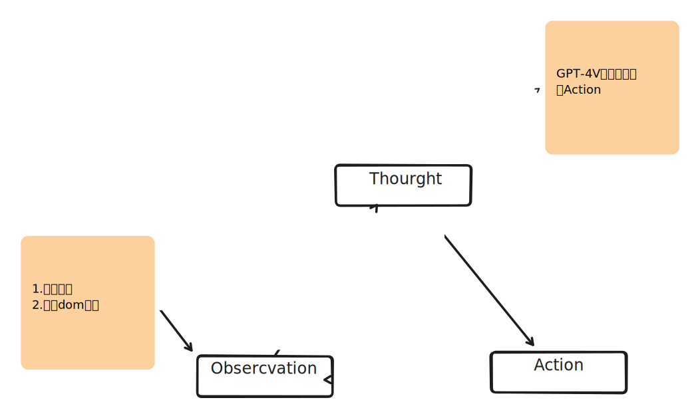

# opengpts - RPA web 自动化

## 1. LLM RPA 实现思路

### SeeAct

SeeAct 强调了利用GPT-4V这样的大型多模态模型来理解和执行网页上的任务。通过提出不同的元素定位方法（如元素属性定位、文本选择定位和图像注释定位），SeeAct能够将自然语言指令转换为具体的网页操作。这一方法在提高网络代理的实用性和执行任务的成功率方面显示出了巨大的潜力，尽管元素定位仍然是一个主要挑战。

### WebVoyager

WebVoyager 通过引入一个创新的、由大型多模态模型（LMM）驱动的网络代理，能够通过与实际网站的交互来完成用户指令。与SeeAct类似，WebVoyager也利用了GPT-4V的强大多模态理解能力，但它更进一步地在真实世界的网站上测试其性能，实现了55.7%的任务成功率，显著超越了纯文本输入模式和仅使用GPT-4的设置。此外，WebVoyager提出了一种新的评估协议，旨在通过自动评估开放式网络代理任务来克服评估挑战，其提出的自动评估与人类判断达到了85.3%的一致性。

### 所以我们也采用了类似的思路，通过输入视觉和文本，来实现RPA的自动化。



概念解释:

- webAction: 单个的浏览器执行动作，如点击、输入、滚动等。
- webActionWorkflow:包含一系列的浏览器执行动作，如点击、输入、滚动等。

### 2. WebAction 网页动作行为

#### 1. Click（点击）:

描述: 在网页内点击元素，如链接或按钮。<br/>
自动化: 如果点击结果为下载PDF文件，系统会自动解析内容并加入到观察中。<br/>
格式: Click [Numerical_Label]

```
    {
      "action": "Click",
      "description": "在网页内点击元素，如链接或按钮。",
      "ui_element": {
        xpath:"",
        cssSelector:"",
        "type": "button",
        "label": "Click",
        "input_field": {
          "placeholder": "Enter Numerical Label"
        }
      }
    }

```


#### 2. Input（输入）:

描述: 选择文本框，清空内容，然后输入新内容。<br/>
自动化: 输入后自动按下ENTER键，减少交互频次。<br/>
格式: Type [Numerical_Label]; [Content]
UI格式:


#### 3. Scroll（滚动）:

描述: 通常涉及页面的垂直移动，有时特定部分可滚动。<br/>
操作: 选择可滚动区域的元素，导航至特定区域进行滚动。<br/>
格式: Scroll [Numerical_Label or WINDOW]; [up or down]

#### 4. Wait（等待）:

描述: 等待网页加载或其他需要时间的操作完成。<br/>
格式: Wait

#### 5. Back（后退）:

描述: 返回至上一网页。<br/>
格式: GoBack

#### 6. Jump to Search Engine（跳转到搜索引擎）:

描述: 当代理在特定网站找不到答案时，跳转至搜索引擎重启搜索。<br/>
实现: 本工作中使用Google搜索。<br/>
格式: Google

#### 7. Answer（回答）:

描述: 任务中的所有问题解决后，结束迭代并提供符合任务要求的答案。<br/>
格式: ANSWER; [Content]<br/>


### 3. WebActionWorkflow 网页动作流程

一个参考Automa实现的网页操作流可视化界面。


### 3.交互公式

#### 3.1 参考ReAct prompting: prompt中需要有一个自然思考的过程。

systemPrompt如下：

```

```


我们将

- 环境表示为 $E$
- 大型多模态模型表示为 $M$，
- 观察空间表示为 $O$，
- 动作空间表示为 $A$。

在时间步骤 $t$，模型接收上下文 $c_t$ 作为输入，它由历史动作 $a_t$ 和观察 $o_t$ 组成，

> 定义如下：$c_t = (o_1, ..., o_{t-1}, a_0, ..., a_{t-1})$

然后模型产生动作 $a_t = M(c_t)$，这个动作随后在环境中执行。

执行后，环境返回在时间 $t+1$ 的观察结果 $o_{t+1} = E(o_t, a_t)$。

然后上下文将被更新，这个交互过程持续进行，直到模型生成一个终止动作或达到最大步骤限制。


#### 3.2  Observation 观察的构建流程


#### llm 行为约束


### DOM功能

* 对当前区域截图
* 对整个页面截图
* 标记当前可交互元素


/**
 * 方式1
 * 
 * 获取截图和dom元素，发送给llm,并且等待llm返回结果
 * 获取截图和dom元素的具体过程：
 * 网页 -> 发送给background,
 * background，dom通过content script获取，截图通过chrome api获取
 * background(网页截图和dom元素)-> 网页
 * 网页(截图和dom元素) -> new action
 * 
 * 
 * 所有的服务器交互都在网页端进行。
 * 插件端只负责和网页端交互，执行动作
 */


/**
 * 方式2
 * 
 * 获取截图和dom元素，发送给llm,并且等待llm返回结果
 * 获取截图和dom元素的具体过程：
 * 网页 -> 发送给background,
 * background，dom通过content script获取，截图通过chrome api获取
 * background(网页截图和dom元素)-> new action
 * background(网页截图和dom元素)-> 网页
 * 网页() -> 更新UI
 * 
 * 
 * 所有的服务器交互都在网页端进行。
 * 插件端只负责和网页端交互，执行动作
 */

// 等待llm返回结果，然后执行下一个动作
// 如果是最后一个动作，那么结束,否则继续执行下一个动作 


## 参考项目

- [Automa](https://github.com/AutomaApp/automa)
- [SeeAct](https://github.com/OSU-NLP-Group/SeeAct)
- [browser-extension](https://github.com/TaxyAI/browser-extension)
- [GPT-4V-Act](https://github.com/ddupont808/GPT-4V-Act)
- [rrweb](https://github.com/rrweb-io/rrweb)
